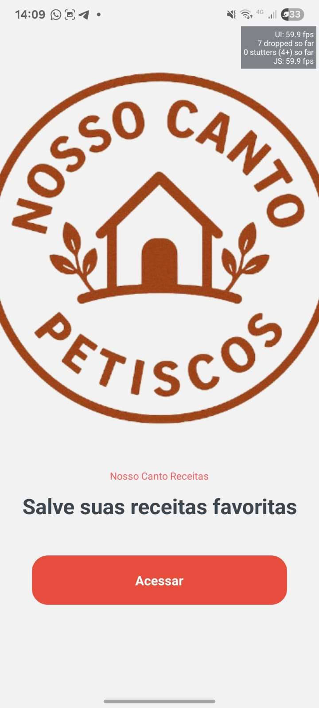
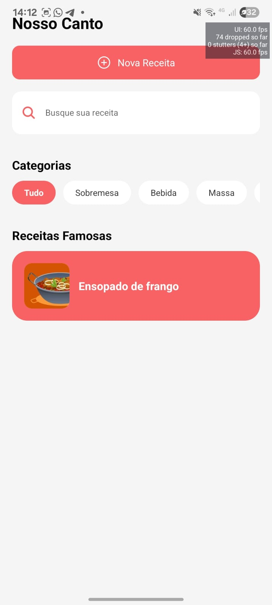
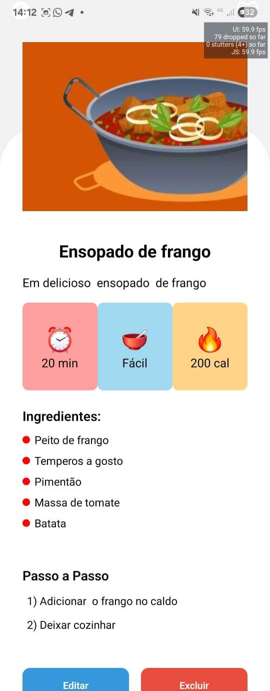
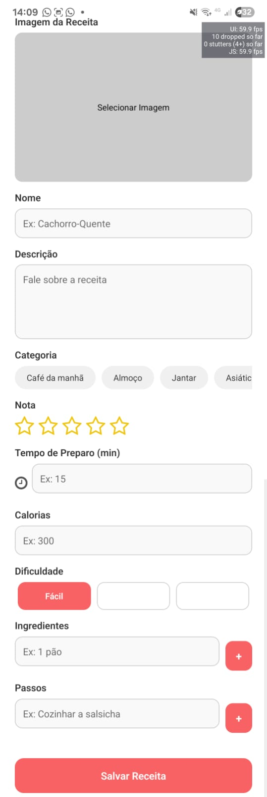

# 🍴 Nosso Canto Receitas 📱🍲

Aplicativo mobile desenvolvido no âmbito de um projeto de extensão universitária do curso de Análise e Desenvolvimento de Sistemas, com o propósito de oferecer suporte tecnológico à gestão, organização e padronização das receitas do microempreendimento “Nosso Canto Petiscos”. A solução visa otimizar os processos produtivos da empreendedora, promover maior controle sobre as preparações culinárias e facilitar o acesso e o registro digital das receitas de forma intuitiva e acessível.

## 📱 Prévia Visual

<p align="center">
  <figure style="display:inline-block; text-align:center; margin: 12px">
    
    <figcaption><strong>WelcomeScreen</strong> — Tela de boas-vindas com botão de entrada para o app</figcaption>
  </figure>
  <figure style="display:inline-block; text-align:center; margin: 12px">
    
    <figcaption><strong>RecipeListScreen</strong> — Lista de receitas com categorias, busca e botão para adicionar nova receita</figcaption>
  </figure>
  <figure style="display:inline-block; text-align:center; margin: 12px">
    
    <figcaption><strong>RecipeDetailsScreen</strong> — Visualização da receita com ingredientes, passo a passo e opções de editar ou excluir</figcaption>
  </figure>
  <figure style="display:inline-block; text-align:center; margin: 12px">
    
    <figcaption><strong>AddRecipeScreen</strong> — Formulário de cadastro/edição com campos detalhados, seleção de imagem, dificuldade e categoria</figcaption>
  </figure>
</p>

---


## 📌 Visão Geral do Projeto

"Nosso Canto Receitas" é um aplicativo multiplataforma (Android/iOS) desenvolvido com React Native e Expo, voltado à organização e consulta de receitas culinárias de maneira prática e eficiente. Criado especialmente para auxiliar o cotidiano da microempreendedora responsável pelo negócio, o app facilita o controle do processo produtivo, a padronização dos pratos e o registro de variações personalizadas.

### ✨ Funcionalidades em Destaque

* 📋 Cadastro de receitas com nome, tempo de preparo, categoria, calorias e nível de dificuldade;
* 🧂 Inclusão de ingredientes e modo de preparo passo a passo;
* 📷 Upload de imagens a partir da câmera ou galeria;
* 🛠️ Edição e exclusão de receitas já cadastradas;
* 🔎 Busca por nome e ingredientes;
* 🗂️ Filtragem por categorias (doces, salgados, bebidas, massas, etc);
* 💾 Armazenamento local com persistência utilizando AsyncStorage.

## 🧑‍💻 Tecnologias Utilizadas

* React Native (com Expo)
* AsyncStorage (armazenamento local)
* React Navigation (navegação entre telas)
* expo-image-picker (captura e seleção de imagens)
* Figma (prototipação da interface e fluxo de navegação)

## 🧩 Estrutura do Projeto

```
📦 projeto-raiz/
├── App.js
├── app.json
├── babel.config.js
├── package.json
├── package-lock.json
├── .gitignore
│
├── 📁 expo/
│   ├── README.md
│   ├── settings.json
│   ├── devices.json
│   └── 📁 web/
│       └── favicon-48.png
│
├── 📁 assets/
│   ├── adaptive-icon.png
│   ├── favicon.png
│   ├── icon.png
│   └── 📁 imagens/
│       ├── default.png
│       └── welcome1.png
│
├── 📁 node_modules/
│
├── 📁 src/
│   ├── 📁 components/
│   │   ├── CategoriesFilter.jsx
│   │   ├── Header.jsx
│   │   ├── RecipeCard.jsx
│   │   └── SearchFilter.jsx
│   │
│   ├── 📁 models/
│   │   ├── Categories.js
│   │   └── Colors.js
│   │
│   ├── 📁 navigation/
│   │   └── AppNavigator.jsx
│   │
│   ├── 📁 screens/
│   │   ├── AddRecipeScreen.jsx
│   │   ├── RecipeDetailsScreen.jsx
│   │   ├── RecipeListScreen.jsx
│   │   └── WelcomeScreen.jsx
│   │
│   └── 📁 storage/
│       └── RecipeStorage.js

```

## 👥 Equipe de Desenvolvimento

* Lucas Campos Muniz Cardoso — Matrícula: 202303471017
* Pedro Paulo de Castro de Jesus — Matrícula: 202302687113
* Orientador: Prof. Ronaldo Candido dos Santos

## 🖼️ Galeria de Telas

| Tela                | Descrição                                                                                  |
| ------------------- | ------------------------------------------------------------------------------------------ |
| WelcomeScreen       | Tela de boas-vindas com acesso inicial ao app.                                             |
| RecipeListScreen    | Lista de receitas com filtros por categoria e barra de busca.                              |
| RecipeDetailsScreen | Tela de visualização da receita, com detalhes, imagem e opções de editar/excluir.          |
| AddRecipeScreen     | Formulário completo para cadastrar ou editar receitas com imagem, categoria e dificuldade. |

---

## 🚀 Como Executar o Projeto

```bash
# Clone o repositório:
git clone https://github.com/lc4rdoso/dispositvosmoveisestacio.git

# Acesse o diretório do projeto:
cd dispositivosmoveisestacio/receitas-app

# Instale as dependências:
npm install

# Inicie a aplicação:
npx expo start
```

Use o aplicativo Expo Go para escanear o QR Code e testar no seu dispositivo.

---

## 🎯 Impacto Social-Comunitário

Este projeto foi concebido dentro do contexto de uma ação extensionista universitária, com o propósito de aplicar soluções tecnológicas em benefício de um microempreendimento local. Ao promover a digitalização e organização dos processos da microempreendedora, o app contribui para a valorização da cultura alimentar, empoderamento feminino e uso consciente da tecnologia no cotidiano de pequenos negócios.

## 🧠 Metodologia de Desenvolvimento

O projeto foi realizado conforme a Etapa 4 do Plano de Ensino da disciplina de Prática Extensionista IV:

1. 🧩 Levantamento de Requisitos: reuniões e escuta ativa com a empreendedora;
2. 🎨 Design da Interface: prototipação e validação no Figma;
3. 💻 Implementação Técnica: codificação com React Native e bibliotecas auxiliares;
4. 🧪 Testes Práticos: simulações com a usuária e coleta de feedback;
5. 📚 Capacitação Final: entrega e instrução prática para uso do app.

## 📄 Licença

Este projeto é destinado exclusivamente a fins acadêmicos e de extensão comunitária, sendo vedado o uso comercial sem autorização prévia.

---

📍 Projeto desenvolvido para a disciplina de Prática Extensionista IV — CST em Análise e Desenvolvimento de Sistemas, Estácio.

📆 Ano: 2025 — Microempreendimento parceiro: Nosso Canto Petiscos 🍢
